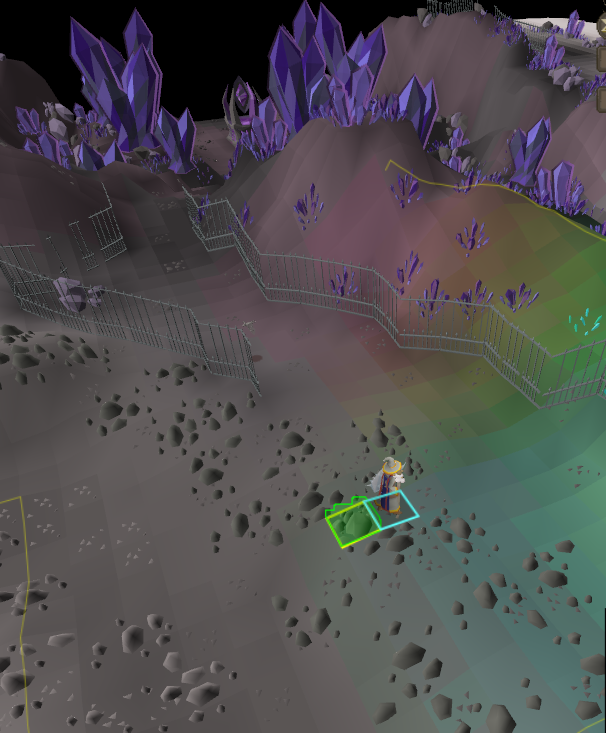
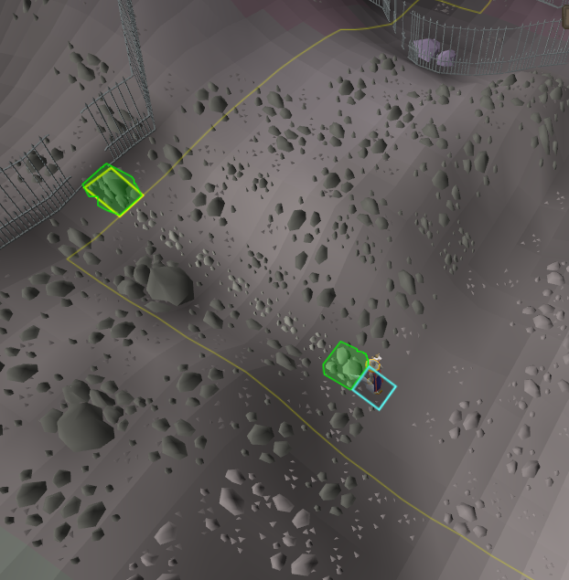

This plugin adds idle movement notifications when you finish climbing over the first obstacle. 
(ie when you click the rocks while standing at the dark essence mine)
  
and when you're at the blood alter and click to slide down the rocks:
